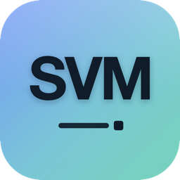

<p align="center">
  
</p>

<h1 align="center">Tandem</h1>

A tabbed desktop app that unifies a **Chromium-style browser**, a **Warp-style terminal**, and a **real VS Code** workspace in one window. One title bar, one tab strip — a single **`+`** opens a new browser tab, terminal, or code workspace, and every tab lives side by side (no mode toggle). macOS first, built so Windows and Linux are an incremental step rather than a rewrite.

- **Browser** — the actual open-source Chromium engine (Electron `<webview>`) wrapped in a Chrome-style UI:
  - Multi-tab strip with favicons, **incognito tabs** (ephemeral session, never recorded to history), and **tab groups** (color, name, collapse, ungroup)
  - **Pin / duplicate / mute** tabs, **reopen closed tab**, and a **right-click tab context menu**
  - Omnibox with connection-lock + bookmark star, back/forward/reload/home, bookmarks bar, in-page find, zoom
  - **Real downloads** with live progress + open/show-in-folder, **print**, **view source**, per-tab **DevTools**, a **tab-search** list, history, and the `⋮` customize menu
- **Terminal** — a genuine login shell via `node-pty`, rendered with `xterm.js` in a Warp-inspired surface:
  - **Command blocks** — OSC 133 shell integration marks each command with a colored status bar (running / success / failure) and lets you **jump between commands** (`⌘↑`/`⌘↓`) and **copy a command's output**
  - **Split panes** — split right (`⌘D`) / down (`⌘⇧D`), focus-next (`⌘]`), close pane (`⌘⇧W`)
  - **In-terminal search** (`⌘F`), **clickable links** (open in the Browser), **themes** (Tokyo Night / Warp Dark / Solarized / Snow), **font zoom**
  - **Command bookmarks** — save commands and re-run/insert them from a panel
  - **Right-click menu** — copy, paste, **insert selection into the input at the cursor**, bookmark command, split
  - **Markdown viewer** — open and read `.md` files as styled prose
  - True-color output (`COLORTERM`/`CLICOLOR`) so `ls`, `git`, prompts render vivid, not grey
- **Code** — a tab running **real VS Code** via [code-server](https://github.com/coder/code-server): open a folder as a workspace and edit it with the full editor, extensions, and language features. Runs locally on loopback. (Requires `code-server`; the cask installs it automatically.)
- **Whiteboard** — an **Excalidraw** canvas for sketches and diagrams, saved locally.
- **Per-app colors** — each workspace has an identity color (browser = blue, terminal = mint, code = amber, whiteboard = violet) shown on its tabs and in the `+` menu, so you can tell them apart at a glance.
- **App themes** — Midnight / Graphite / Nord / Aurora reskin the whole UI (Settings ▸ Appearance), independent of the terminal theme
  - Bundles **MesloLGS NF**, so Powerline/Nerd-Font prompts (Powerlevel10k, Starship) render correctly instead of tofu
  - Session tabs, a rounded block surface with a command counter + LIVE badge, and its own menu

  > Shell integration injects via a wrapper `ZDOTDIR` that sources your real config first, so Powerlevel10k and friends keep working untouched.

### Menus & shortcuts (merged from both apps)

- **Native macOS menu bar** combining Chromium's menus (File / Edit / View / History / Bookmarks) with Warp's terminal menus (sessions, clear, palette).
- **Command palette** (`⌘P`) — fuzzy-search every action across Browser, Terminal, View, and App, with category tags and shortcut hints.
- **In-window menus** — the Chrome `⋮` menu (new tab, history, downloads, bookmarks, zoom row, find, print, settings) and the Warp `≡` menu (new/clear/close session, palette, split, settings).

| Shortcut | Action | | Shortcut | Action |
|---|---|---|---|---|
| `⌘1` / `⌘2` | Browser / Terminal | | `⌘P` | Command palette |
| `⌘T` | New browser tab | | `⌘⇧T` | New terminal session |
| `⌘W` | Close tab | | `⌘K` | Clear session |
| `⌘R` | Reload page | | `⌘F` | Find in page |
| `⌘D` | Bookmark tab | | `⌘⇧B` | Toggle bookmarks bar |
| `⌘N` | New window | | `⌘±` / `⌘0` | Zoom / reset |

## Requirements

- macOS (current target)
- Node.js 18+ and npm
- Xcode Command Line Tools (`xcode-select --install`) — needed to compile `node-pty`'s native binary

## Run it

```bash
cd tandem
npm install      # installs deps; forge compiles node-pty against Electron's ABI
npm start        # launches the app
```

> First launch builds the native terminal module, so it takes a bit longer. Subsequent starts are fast.

## Install with Homebrew

Tandem ships as a Homebrew **Cask**. Build the app, then install it from a tap:

```bash
npm install
npm run dist                                   # → dist/Tandem-<version>-arm64.dmg (+ Tandem.app)

brew tap-new "$USER/tandem" --no-git
cp homebrew/Casks/tandem.rb "$(brew --repository)/Library/Taps/$USER/homebrew-tandem/Casks/"
brew install --cask "$USER/tandem/tandem"      # → /Applications/Tandem.app
```

Uninstall with `brew uninstall --cask "$USER/tandem/tandem"`. The build is
**arm64, ad-hoc signed** — on first launch right-click → *Open* (or run
`xattr -dr com.apple.quarantine "/Applications/Tandem.app"`). Full tap +
public-release instructions are in [homebrew/README.md](homebrew/README.md).

## Build a distributable

```bash
npm run dist     # robust local packager: builds Tandem.app + DMG under ./dist
```

> `npm run dist` clones the local Electron runtime, injects the app + runtime
> `node_modules`, fixes the Info.plist, and ad-hoc signs — see
> [scripts/build-dmg.sh](scripts/build-dmg.sh). (`npm run make` uses
> electron-forge, which is preferable on CI but flaky in some sandboxes.)

## Architecture

```
src/
├── main/                     # Electron main process (Node.js side)
│   ├── index.js              # app lifecycle + IPC
│   ├── windows.js            # window factory (shared by startup + "New Window")
│   ├── menu.js               # native macOS menu bar -> renderer actions
│   └── terminal/
│       ├── shell.js          # per-OS shell resolution  ← the cross-platform seam
│       └── pty-manager.js    # spawns/streams pty sessions, owns terminal IPC
├── preload/
│   └── preload.js            # the only renderer↔main bridge (contextIsolation on)
└── renderer/                 # UI (isolated, no Node access)
    ├── index.html            # app shell: mode switch + both surfaces + overlays
    ├── js/
    │   ├── app.js            # mode switching, action router, palette, dropdowns
    │   ├── browser.js        # Chrome-style tabs, omnibox, bookmarks, find, zoom
    │   └── terminal.js       # Warp-style sessions + xterm wiring
    └── styles/
        ├── tokens.css        # design tokens (palette, type, motion, geometry)
        ├── app.css           # shell, mode switch, toast, slide-over panel
        ├── browser.css       # tab strip, toolbar, omnibox, bookmarks bar
        ├── terminal.css      # Warp tabstrip + block surface
        └── menu.css          # dropdown menus + command palette
```

**Action router.** Every UI affordance — native menu item, in-window menu, command
palette entry, toolbar button — emits the same string action (e.g. `browser:reload`,
`terminal:clear`). `app.js`'s `dispatch()` is the single place that routes them, so
adding a command means adding one entry, not wiring N call sites.

**Process model.** The renderer is sandboxed (no Node integration). It talks to the
main process only through the narrow `window.tandem` API defined in `preload.js`.
The real shell runs in the main process; keystrokes and output stream over IPC.

**Security posture.** `contextIsolation: true`, `nodeIntegration: false`, a strict
CSP on the app shell, and an explicit IPC surface. The `<webview>` renders untrusted
web content in its own isolated process.

## Extending to Windows / Linux

The codebase is structured so platform differences are localized:

1. **Shell** — `src/main/terminal/shell.js` already branches on `process.platform`
   (PowerShell/cmd on Windows, `$SHELL` on POSIX). Tune args there.
2. **Window chrome** — `titleBarStyle: 'hiddenInset'` and the `--traffic-lights`
   CSS offset are macOS-specific; gate them on platform when you add Windows.
3. **Makers** — add `maker-squirrel` (Windows) and `maker-deb`/`maker-rpm` (Linux)
   to `forge.config.js`. Electron + node-pty already support all three.

## Roadmap ideas

- Multiple browser tabs and multiple terminal sessions (the pty manager is already keyed by id).
- Split view (browser + terminal side by side) as an alternate layout.
- Session persistence (restore last URL and working directory).
- Per-tab Chromium profiles / partitions.
